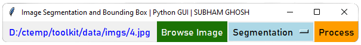
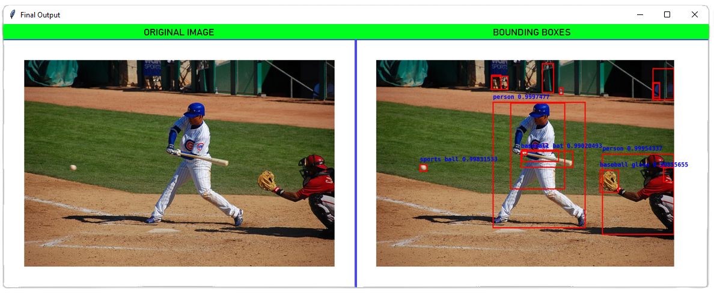
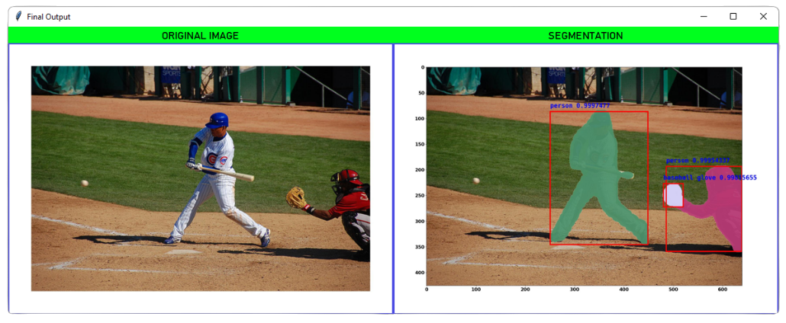

# AI_Image_Toolkit
This project is about a simple AI toolkit to identify important objects (with a certain *confidence* value) within an image by trying to draw bounding boxes and segmenting the image into its constituents.

**To run the tool simply run the `toolkit.py` as an executable**
## Here are some screenshots :
### *The tool interface* ###

### *The bounding boxes on a sample image* ###

### *The segmentation masks on a sample image* ###

